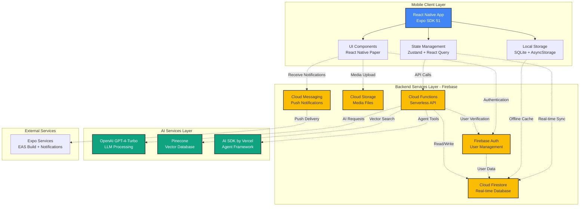
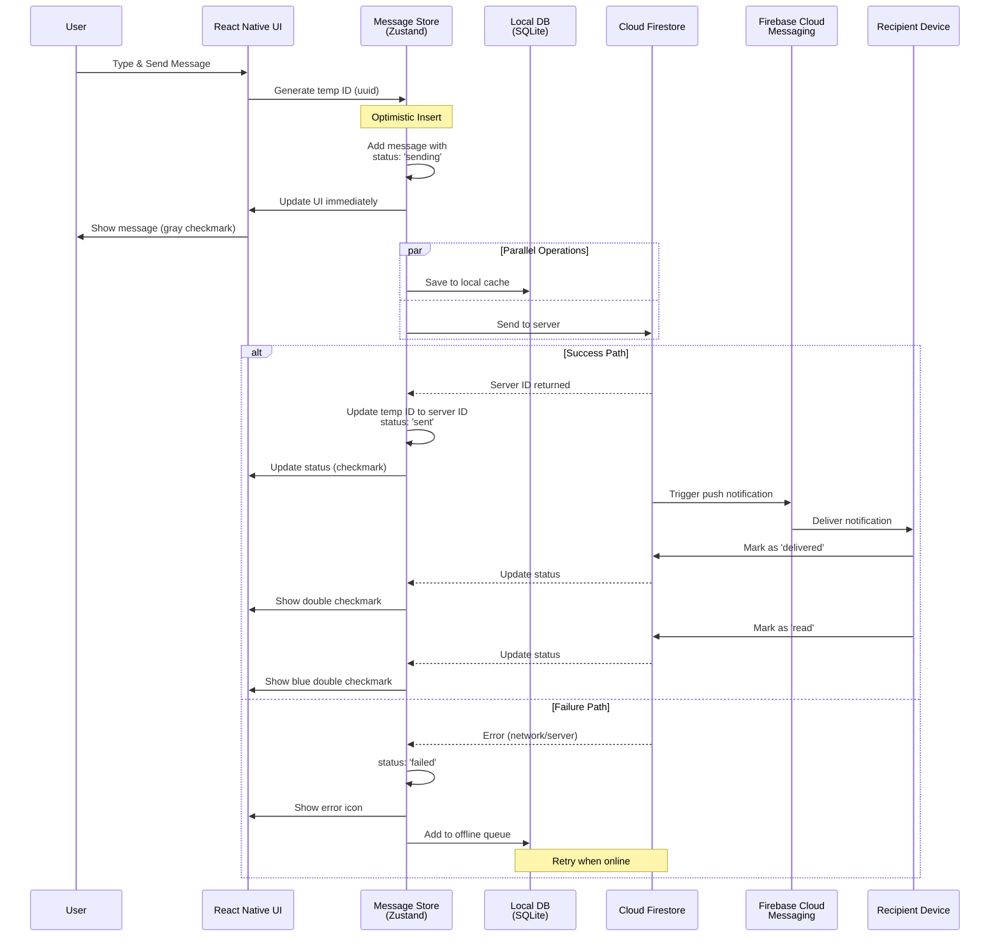
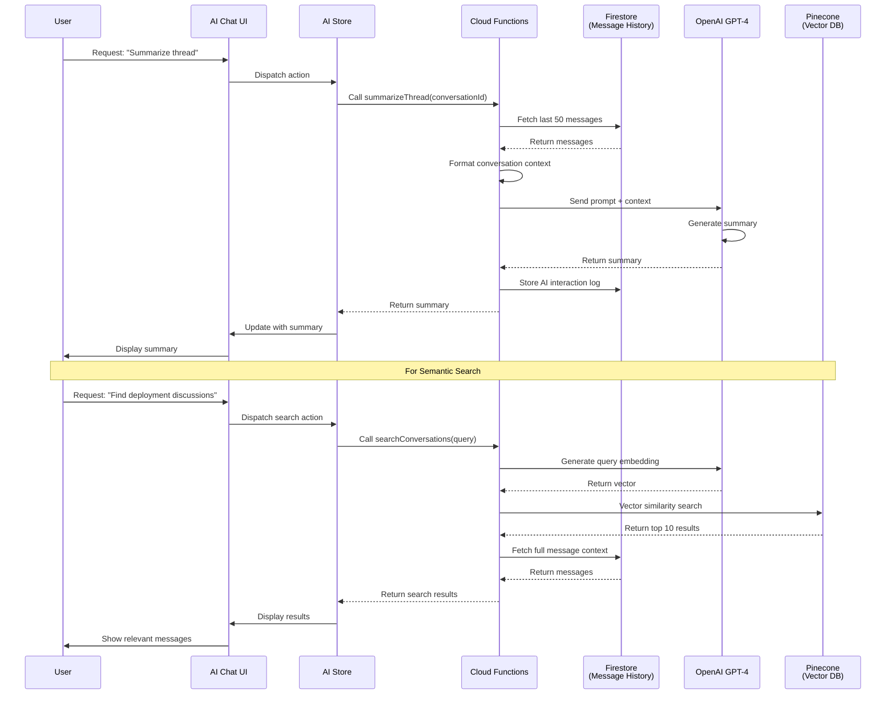
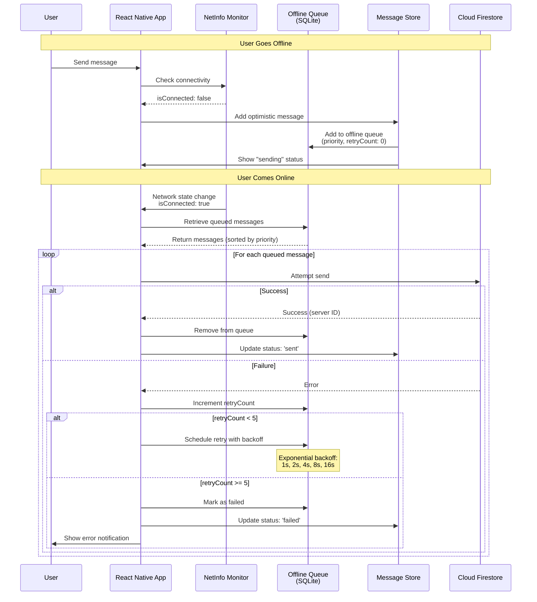
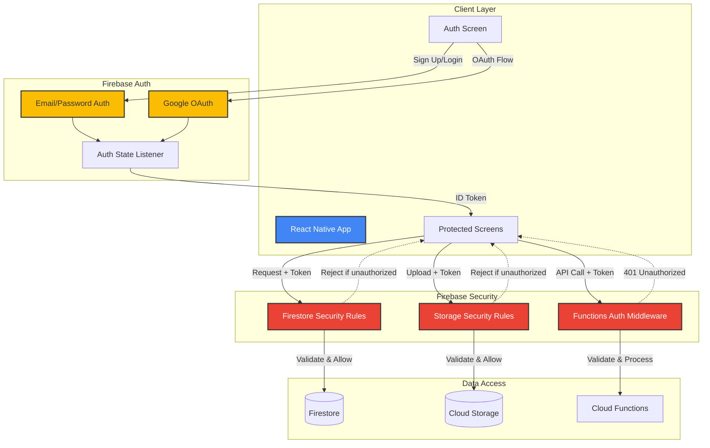
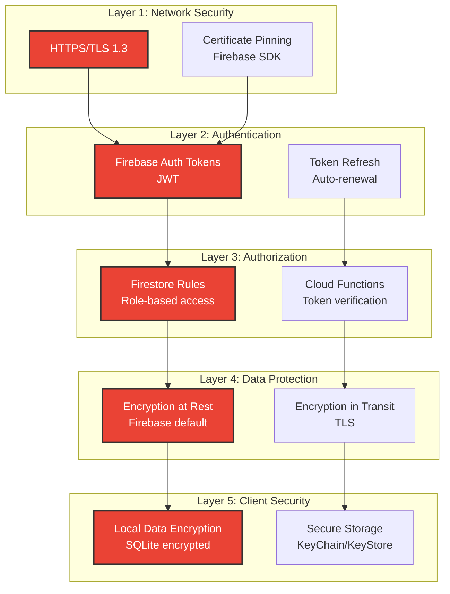
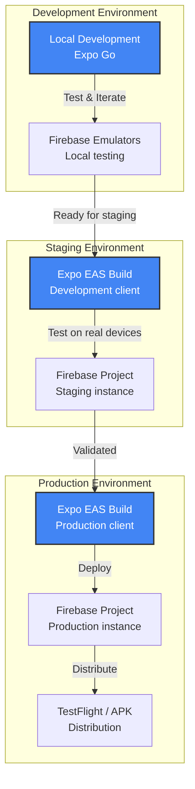

# MessageAI System Architecture

**Version:** 1.0  
**Date:** October 20, 2025  
**Project:** MessageAI - AI-Enhanced Mobile Messaging Platform

---

## Table of Contents

1. [High-Level System Architecture](#high-level-system-architecture)
2. [Component Architecture](#component-architecture)
3. [Data Flow Architecture](#data-flow-architecture)
4. [Network Architecture](#network-architecture)
5. [Security Architecture](#security-architecture)

---

## High-Level System Architecture

### Overview

MessageAI follows a three-tier architecture with mobile client, Firebase backend, and AI services layer.



---

## Component Architecture

### React Native App Structure

```mermaid
graph TD
    subgraph "App Entry Point"
        ROOT[app/_layout.tsx<br/>Root Layout]
    end
    
    subgraph "Authentication Flow"
        AUTH_LAYOUT[app/auth/_layout.tsx]
        LOGIN[app/auth/login.tsx]
        SIGNUP[app/auth/signup.tsx]
        PROFILE[app/auth/create-profile.tsx]
    end
    
    subgraph "Main App Flow"
        TAB_LAYOUT[app/tabs/_layout.tsx<br/>Tab Navigator]
        CONV_LIST[app/tabs/conversations.tsx<br/>Conversations Screen]
        AI_CHAT[app/tabs/ai-assistant.tsx<br/>AI Assistant Screen]
        SETTINGS[app/tabs/settings.tsx<br/>Settings Screen]
        CONV_DETAIL[app/conversation/[id].tsx<br/>Chat Screen]
    end
    
    subgraph "Shared Components"
        MSG_BUBBLE[MessageBubble.tsx]
        MSG_LIST[MessageList.tsx]
        MSG_INPUT[MessageInput.tsx]
        CONV_CARD[ConversationCard.tsx]
        AI_INTERFACE[AIChatInterface.tsx]
    end
    
    subgraph "Services Layer"
        FIREBASE[Firebase Services]
        AI_SERVICES[AI Services]
        LOCAL_DB[Local Database]
    end
    
    subgraph "State Management"
        AUTH_STORE[authStore]
        CONV_STORE[conversationStore]
        MSG_STORE[messageStore]
        AI_STORE[aiStore]
    end
    
    ROOT --> AUTH_LAYOUT
    ROOT --> TAB_LAYOUT
    
    AUTH_LAYOUT --> LOGIN
    AUTH_LAYOUT --> SIGNUP
    AUTH_LAYOUT --> PROFILE
    
    TAB_LAYOUT --> CONV_LIST
    TAB_LAYOUT --> AI_CHAT
    TAB_LAYOUT --> SETTINGS
    
    CONV_LIST --> CONV_DETAIL
    
    CONV_DETAIL --> MSG_LIST
    CONV_DETAIL --> MSG_INPUT
    MSG_LIST --> MSG_BUBBLE
    
    AI_CHAT --> AI_INTERFACE
    
    LOGIN --> FIREBASE
    SIGNUP --> FIREBASE
    CONV_DETAIL --> FIREBASE
    CONV_DETAIL --> LOCAL_DB
    AI_INTERFACE --> AI_SERVICES
    
    FIREBASE --> AUTH_STORE
    FIREBASE --> CONV_STORE
    FIREBASE --> MSG_STORE
    AI_SERVICES --> AI_STORE
    
    style ROOT fill:#4285F4,stroke:#333,stroke-width:2px,color:#fff
    style TAB_LAYOUT fill:#4285F4,stroke:#333,stroke-width:2px,color:#fff
    style FIREBASE fill:#FBBC04,stroke:#333,stroke-width:2px
    style AI_SERVICES fill:#10A37F,stroke:#333,stroke-width:2px,color:#fff
```

---

## Data Flow Architecture

### Message Sending Flow (Optimistic UI)



### AI Feature Request Flow



### Offline Queue Processing Flow



---

## Network Architecture

### API Endpoints & Data Flow

```mermaid
graph LR
    subgraph "Mobile Client"
        A[React Native App]
    end
    
    subgraph "Firebase APIs"
        B[Firebase Auth API<br/>identitytoolkit.googleapis.com]
        C[Firestore API<br/>firestore.googleapis.com]
        D[Storage API<br/>storage.googleapis.com]
        E[FCM API<br/>fcm.googleapis.com]
    end
    
    subgraph "Cloud Functions Endpoints"
        F1[/api/ai/summarize]
        F2[/api/ai/extractActions]
        F3[/api/ai/search]
        F4[/api/ai/detectPriority]
        F5[/api/ai/trackDecisions]
        F6[/api/ai/agent]
    end
    
    subgraph "External APIs"
        G[OpenAI API<br/>api.openai.com]
        H[Pinecone API<br/>api.pinecone.io]
    end
    
    A -->|REST + WebSocket| B
    A -->|WebSocket| C
    A -->|REST| D
    A -->|REST| E
    A -->|HTTPS| F1
    A -->|HTTPS| F2
    A -->|HTTPS| F3
    A -->|HTTPS| F4
    A -->|HTTPS| F5
    A -->|HTTPS| F6
    
    F1 -->|HTTPS| G
    F2 -->|HTTPS| G
    F3 -->|HTTPS| G
    F3 -->|HTTPS| H
    F4 -->|HTTPS| G
    F5 -->|HTTPS| G
    F6 -->|HTTPS| G
    
    C -.->|Real-time Updates| A
    E -.->|Push Notifications| A
    
    style A fill:#4285F4,stroke:#333,stroke-width:2px,color:#fff
    style B fill:#FBBC04,stroke:#333,stroke-width:2px
    style C fill:#FBBC04,stroke:#333,stroke-width:2px
    style D fill:#FBBC04,stroke:#333,stroke-width:2px
    style E fill:#FBBC04,stroke:#333,stroke-width:2px
    style G fill:#10A37F,stroke:#333,stroke-width:2px,color:#fff
    style H fill:#10A37F,stroke:#333,stroke-width:2px,color:#fff
```

---

## Security Architecture

### Authentication & Authorization Flow



### Security Layers



---

## Architecture Principles

### 1. Separation of Concerns

- **UI Layer**: React Native components (presentation only)
- **Business Logic**: Custom hooks + Zustand stores
- **Data Layer**: Firebase services + SQLite
- **AI Layer**: Cloud Functions (isolated from client)

### 2. Offline-First Design

- Local SQLite cache for all messages
- Optimistic UI updates
- Offline queue with retry logic
- Background sync when connectivity returns

### 3. Real-Time by Default

- Firestore real-time listeners for messages
- WebSocket connections for presence
- Push notifications for background updates

### 4. Security by Design

- API keys never in client code
- Cloud Functions as secure gateway to AI services
- Firestore security rules enforce data access
- Token-based authentication for all requests

### 5. Scalability Considerations

- Message pagination (50 messages per page)
- Conversation list lazy loading
- Image compression before upload
- Vector database for semantic search
- Serverless functions for horizontal scaling

---

## Technology Stack Alignment

### Mobile Client

| Layer | Technology | Purpose |
|-------|-----------|---------|
| Framework | React Native 0.74 + Expo SDK 51 | Cross-platform mobile development |
| Language | TypeScript 5.0 | Type safety and developer experience |
| UI Components | React Native Paper | Material Design components |
| Navigation | Expo Router | File-based routing |
| State Management | Zustand + React Query | Client state + server cache |
| Local Storage | Expo SQLite + AsyncStorage | Offline persistence |

### Backend Services

| Service | Technology | Purpose |
|---------|-----------|---------|
| Database | Cloud Firestore | Real-time NoSQL database |
| Authentication | Firebase Auth | User management |
| Functions | Cloud Functions (Node.js 20) | Serverless API |
| Storage | Cloud Storage | Media file storage |
| Messaging | Firebase Cloud Messaging | Push notifications |

### AI Services

| Service | Technology | Purpose |
|---------|-----------|---------|
| LLM | OpenAI GPT-4-Turbo | Natural language processing |
| Vector DB | Pinecone | Semantic search |
| Agent Framework | AI SDK by Vercel | Tool calling and agents |
| Embeddings | OpenAI text-embedding-3-small | Vector generation |

---

## Deployment Architecture



---

## Performance Considerations

### Client-Side Optimization

1. **Message Virtualization**: FlatList with `windowSize` optimization
2. **Image Lazy Loading**: Load images as they enter viewport
3. **Component Memoization**: React.memo for expensive components
4. **Debounced Updates**: Typing indicators, search queries
5. **Local Cache**: SQLite for instant message display

### Server-Side Optimization

1. **Cloud Functions**: Cold start mitigation (keep-alive)
2. **Firestore Indexes**: Composite indexes for complex queries
3. **CDN**: Firebase Hosting for static assets
4. **Rate Limiting**: Prevent abuse of AI endpoints
5. **Caching**: AI response cache for common queries

### Network Optimization

1. **Batch Operations**: Group Firestore writes
2. **Compression**: Image/video compression before upload
3. **WebSocket**: Persistent connections for real-time updates
4. **Retry Logic**: Exponential backoff for failed requests
5. **Prefetching**: Preload conversation data on app start

---

## Monitoring & Observability

### Key Metrics

1. **Performance Metrics**
   - Message send latency (<500ms target)
   - App launch time (<2s target)
   - Real-time sync delay (<100ms target)

2. **Reliability Metrics**
   - Message delivery rate (100% target)
   - Offline queue success rate (>99% target)
   - App crash rate (<1% target)

3. **AI Metrics**
   - AI response time (<3s target)
   - AI accuracy (>85% target)
   - Token usage and cost

4. **User Metrics**
   - Daily active users
   - Messages sent per user
   - AI features usage rate

---

## Version History

| Version | Date | Changes |
|---------|------|---------|
| 1.0 | Oct 20, 2025 | Initial system architecture document |

---

**Status:** ✅ Architecture Defined  
**Next Steps:** Component diagrams, sequence diagrams, database schemas


