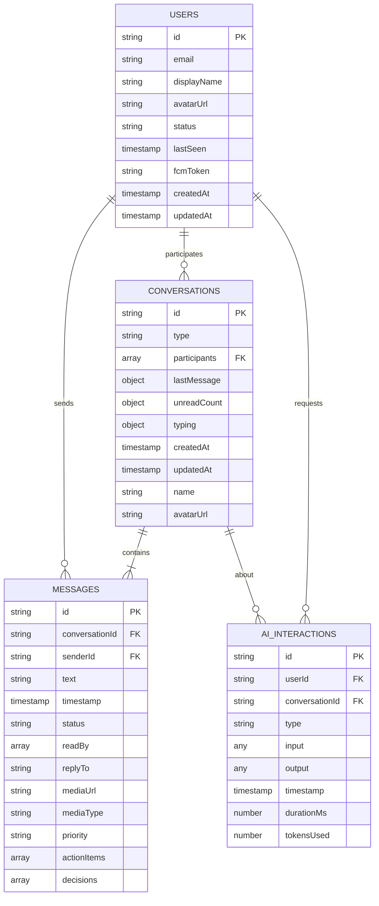
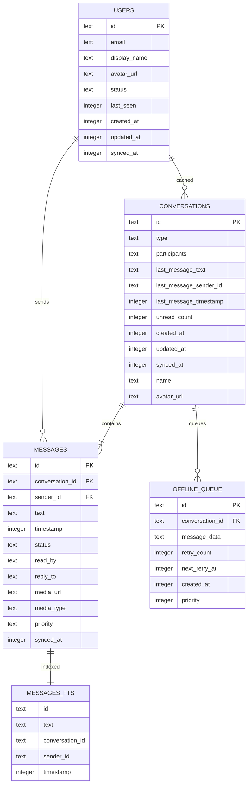
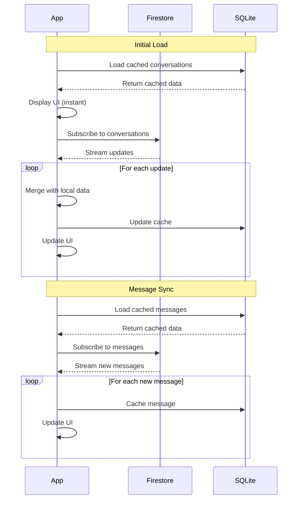

# MessageAI Database Schema

**Version:** 1.0  
**Date:** October 20, 2025  
**Project:** MessageAI - Database Architecture

---

## Table of Contents

1. [Firestore Schema](#firestore-schema)
2. [SQLite Schema](#sqlite-schema)
3. [Data Models](#data-models)
4. [Indexes](#indexes)
5. [Security Rules](#security-rules)

---

## Firestore Schema

### Collection Structure

```
messageai (root)
├── users/
│   └── {userId}/
│       ├── id: string
│       ├── email: string
│       ├── displayName: string
│       ├── avatarUrl: string (optional)
│       ├── status: 'online' | 'offline' | 'away'
│       ├── lastSeen: timestamp
│       ├── fcmToken: string (optional)
│       ├── createdAt: timestamp
│       └── updatedAt: timestamp
│
├── conversations/
│   └── {conversationId}/
│       ├── id: string
│       ├── type: 'direct' | 'group'
│       ├── participants: string[] (user IDs)
│       ├── lastMessage: {
│       │   ├── text: string
│       │   ├── senderId: string
│       │   ├── timestamp: timestamp
│       │   └── type: 'text' | 'image' | 'video'
│       ├── }
│       ├── unreadCount: { [userId]: number }
│       ├── typing: { [userId]: timestamp }
│       ├── createdAt: timestamp
│       ├── updatedAt: timestamp
│       ├── name: string (optional, for groups)
│       └── avatarUrl: string (optional, for groups)
│       │
│       └── messages/ (subcollection)
│           └── {messageId}/
│               ├── id: string
│               ├── conversationId: string
│               ├── senderId: string
│               ├── text: string
│               ├── timestamp: timestamp
│               ├── status: 'sending' | 'sent' | 'delivered' | 'read'
│               ├── readBy: string[] (user IDs)
│               ├── replyTo: string (optional, message ID)
│               ├── mediaUrl: string (optional)
│               ├── mediaType: 'image' | 'video' | 'audio' (optional)
│               ├── priority: 'low' | 'normal' | 'high' | 'urgent' (optional)
│               ├── actionItems: string[] (optional)
│               └── decisions: string[] (optional)
│
└── aiInteractions/
    └── {interactionId}/
        ├── id: string
        ├── userId: string
        ├── conversationId: string (optional)
        ├── type: 'summarize' | 'extract_actions' | 'search' | 'detect_priority' | 'track_decisions' | 'agent'
        ├── input: any
        ├── output: any
        ├── timestamp: timestamp
        ├── durationMs: number
        └── tokensUsed: number (optional)
```

### Visual Representation



---

## SQLite Schema

### Local Cache Database

**Database Name:** `messageai.db`

```sql
-- Users table (cached for offline access)
CREATE TABLE users (
    id TEXT PRIMARY KEY,
    email TEXT NOT NULL,
    display_name TEXT NOT NULL,
    avatar_url TEXT,
    status TEXT DEFAULT 'offline',
    last_seen INTEGER,
    created_at INTEGER NOT NULL,
    updated_at INTEGER NOT NULL,
    synced_at INTEGER NOT NULL
);

CREATE INDEX idx_users_email ON users(email);
CREATE INDEX idx_users_status ON users(status);

-- Conversations table
CREATE TABLE conversations (
    id TEXT PRIMARY KEY,
    type TEXT NOT NULL CHECK(type IN ('direct', 'group')),
    participants TEXT NOT NULL, -- JSON array
    last_message_text TEXT,
    last_message_sender_id TEXT,
    last_message_timestamp INTEGER,
    unread_count INTEGER DEFAULT 0,
    created_at INTEGER NOT NULL,
    updated_at INTEGER NOT NULL,
    synced_at INTEGER NOT NULL,
    name TEXT,
    avatar_url TEXT
);

CREATE INDEX idx_conversations_updated_at ON conversations(updated_at DESC);
CREATE INDEX idx_conversations_participants ON conversations(participants);

-- Messages table
CREATE TABLE messages (
    id TEXT PRIMARY KEY,
    conversation_id TEXT NOT NULL,
    sender_id TEXT NOT NULL,
    text TEXT NOT NULL,
    timestamp INTEGER NOT NULL,
    status TEXT NOT NULL CHECK(status IN ('sending', 'sent', 'delivered', 'read', 'failed')),
    read_by TEXT, -- JSON array
    reply_to TEXT,
    media_url TEXT,
    media_type TEXT CHECK(media_type IN ('image', 'video', 'audio')),
    priority TEXT CHECK(priority IN ('low', 'normal', 'high', 'urgent')),
    synced_at INTEGER NOT NULL,
    FOREIGN KEY (conversation_id) REFERENCES conversations(id) ON DELETE CASCADE,
    FOREIGN KEY (sender_id) REFERENCES users(id)
);

CREATE INDEX idx_messages_conversation_id ON messages(conversation_id);
CREATE INDEX idx_messages_timestamp ON messages(timestamp DESC);
CREATE INDEX idx_messages_status ON messages(status);
CREATE INDEX idx_messages_sender_id ON messages(sender_id);

-- Offline queue table
CREATE TABLE offline_queue (
    id TEXT PRIMARY KEY,
    conversation_id TEXT NOT NULL,
    message_data TEXT NOT NULL, -- JSON
    retry_count INTEGER DEFAULT 0,
    next_retry_at INTEGER,
    created_at INTEGER NOT NULL,
    priority INTEGER DEFAULT 0, -- Higher = more important
    FOREIGN KEY (conversation_id) REFERENCES conversations(id)
);

CREATE INDEX idx_offline_queue_next_retry ON offline_queue(next_retry_at);
CREATE INDEX idx_offline_queue_priority ON offline_queue(priority DESC, created_at ASC);

-- Full-Text Search (FTS5) table
CREATE VIRTUAL TABLE messages_fts USING fts5(
    id UNINDEXED,
    text,
    conversation_id UNINDEXED,
    sender_id UNINDEXED,
    timestamp UNINDEXED,
    tokenize = 'porter unicode61'
);

-- Triggers to keep FTS table in sync
CREATE TRIGGER messages_after_insert AFTER INSERT ON messages
BEGIN
    INSERT INTO messages_fts(id, text, conversation_id, sender_id, timestamp)
    VALUES (new.id, new.text, new.conversation_id, new.sender_id, new.timestamp);
END;

CREATE TRIGGER messages_after_update AFTER UPDATE ON messages
BEGIN
    UPDATE messages_fts 
    SET text = new.text 
    WHERE id = new.id;
END;

CREATE TRIGGER messages_after_delete AFTER DELETE ON messages
BEGIN
    DELETE FROM messages_fts WHERE id = old.id;
END;

-- AI interactions cache (optional)
CREATE TABLE ai_interactions_cache (
    id TEXT PRIMARY KEY,
    user_id TEXT NOT NULL,
    conversation_id TEXT,
    type TEXT NOT NULL,
    input_hash TEXT NOT NULL, -- Hash of input for cache key
    output TEXT NOT NULL, -- JSON
    timestamp INTEGER NOT NULL,
    expires_at INTEGER NOT NULL,
    FOREIGN KEY (user_id) REFERENCES users(id)
);

CREATE INDEX idx_ai_cache_hash ON ai_interactions_cache(input_hash);
CREATE INDEX idx_ai_cache_expires ON ai_interactions_cache(expires_at);
```

### Visual Representation



---

## Data Models (TypeScript)

### Core Models

```typescript
// User Model
interface User {
  id: string;
  email: string;
  displayName: string;
  avatarUrl?: string;
  status: 'online' | 'offline' | 'away';
  lastSeen: Timestamp;
  fcmToken?: string;
  createdAt: Timestamp;
  updatedAt?: Timestamp;
}

// Conversation Model
interface Conversation {
  id: string;
  type: 'direct' | 'group';
  participants: string[]; // user IDs
  lastMessage: {
    text: string;
    senderId: string;
    timestamp: Timestamp;
    type: 'text' | 'image' | 'video' | 'audio';
  };
  unreadCount: Record<string, number>; // userId -> count
  typing?: Record<string, Timestamp>; // userId -> lastTypingTime
  createdAt: Timestamp;
  updatedAt: Timestamp;
  
  // Group chat specific
  name?: string;
  avatarUrl?: string;
}

// Message Model
interface Message {
  id: string;
  conversationId: string;
  senderId: string;
  text: string;
  timestamp: Timestamp;
  status: 'sending' | 'sent' | 'delivered' | 'read' | 'failed';
  readBy: string[]; // user IDs
  
  // Optional fields
  replyTo?: string; // message ID
  mediaUrl?: string;
  mediaType?: 'image' | 'video' | 'audio';
  
  // AI metadata
  priority?: 'low' | 'normal' | 'high' | 'urgent';
  actionItems?: string[];
  decisions?: string[];
}

// AI Interaction Model
interface AIInteraction {
  id: string;
  userId: string;
  conversationId?: string;
  type: 'summarize' | 'extract_actions' | 'search' | 'detect_priority' | 'track_decisions' | 'agent';
  input: any;
  output: any;
  timestamp: Timestamp;
  durationMs: number;
  tokensUsed?: number;
}

// Offline Queue Item
interface QueuedMessage {
  id: string;
  conversationId: string;
  messageData: Message;
  retryCount: number;
  nextRetryAt: number;
  createdAt: number;
  priority: number;
}
```

---

## Indexes

### Firestore Composite Indexes

```json
{
  "indexes": [
    {
      "collectionGroup": "conversations",
      "queryScope": "COLLECTION",
      "fields": [
        { "fieldPath": "participants", "arrayConfig": "CONTAINS" },
        { "fieldPath": "updatedAt", "order": "DESCENDING" }
      ]
    },
    {
      "collectionGroup": "messages",
      "queryScope": "COLLECTION",
      "fields": [
        { "fieldPath": "conversationId", "order": "ASCENDING" },
        { "fieldPath": "timestamp", "order": "DESCENDING" }
      ]
    },
    {
      "collectionGroup": "messages",
      "queryScope": "COLLECTION",
      "fields": [
        { "fieldPath": "conversationId", "order": "ASCENDING" },
        { "fieldPath": "status", "order": "ASCENDING" },
        { "fieldPath": "timestamp", "order": "DESCENDING" }
      ]
    },
    {
      "collectionGroup": "messages",
      "queryScope": "COLLECTION",
      "fields": [
        { "fieldPath": "senderId", "order": "ASCENDING" },
        { "fieldPath": "timestamp", "order": "DESCENDING" }
      ]
    },
    {
      "collectionGroup": "aiInteractions",
      "queryScope": "COLLECTION",
      "fields": [
        { "fieldPath": "userId", "order": "ASCENDING" },
        { "fieldPath": "timestamp", "order": "DESCENDING" }
      ]
    },
    {
      "collectionGroup": "aiInteractions",
      "queryScope": "COLLECTION",
      "fields": [
        { "fieldPath": "conversationId", "order": "ASCENDING" },
        { "fieldPath": "timestamp", "order": "DESCENDING" }
      ]
    }
  ]
}
```

### SQLite Indexes

Already defined in SQL schema above. Key indexes:

- `idx_users_email` - Fast user lookup by email
- `idx_users_status` - Filter online/offline users
- `idx_conversations_updated_at` - Sort conversations by recent activity
- `idx_conversations_participants` - Find conversations by participant
- `idx_messages_conversation_id` - Fetch messages for a conversation
- `idx_messages_timestamp` - Sort messages chronologically
- `idx_messages_status` - Filter messages by delivery status
- `idx_offline_queue_next_retry` - Process queue efficiently
- `idx_ai_cache_hash` - Fast cache lookup

---

## Security Rules

### Firestore Security Rules

```javascript
rules_version = '2';
service cloud.firestore {
  match /databases/{database}/documents {
    
    // Helper functions
    function isAuthenticated() {
      return request.auth != null;
    }
    
    function isOwner(userId) {
      return request.auth.uid == userId;
    }
    
    function isParticipant(participants) {
      return request.auth.uid in participants;
    }
    
    // Users collection
    match /users/{userId} {
      // Anyone can read user profiles (for display names, avatars)
      allow read: if isAuthenticated();
      
      // Only the user can create/update their own profile
      allow create: if isOwner(userId);
      allow update: if isOwner(userId);
      
      // Users can update their own status and lastSeen
      allow update: if isOwner(userId) 
                    && request.resource.data.diff(resource.data).affectedKeys()
                       .hasOnly(['status', 'lastSeen', 'fcmToken', 'updatedAt']);
    }
    
    // Conversations collection
    match /conversations/{conversationId} {
      // Only participants can read conversations
      allow read: if isAuthenticated() 
                  && isParticipant(resource.data.participants);
      
      // Only participants can create conversations
      allow create: if isAuthenticated() 
                    && isParticipant(request.resource.data.participants)
                    && request.auth.uid in request.resource.data.participants;
      
      // Only participants can update conversations
      allow update: if isAuthenticated() 
                    && isParticipant(resource.data.participants);
      
      // Messages subcollection
      match /messages/{messageId} {
        // Only participants can read messages
        allow read: if isAuthenticated() 
                    && isParticipant(get(/databases/$(database)/documents/conversations/$(conversationId)).data.participants);
        
        // Only participants can create messages
        allow create: if isAuthenticated() 
                      && isParticipant(get(/databases/$(database)/documents/conversations/$(conversationId)).data.participants)
                      && request.auth.uid == request.resource.data.senderId;
        
        // Only participants can update messages (for read receipts)
        allow update: if isAuthenticated() 
                      && isParticipant(get(/databases/$(database)/documents/conversations/$(conversationId)).data.participants);
      }
    }
    
    // AI interactions collection
    match /aiInteractions/{interactionId} {
      // Only the user can read their own AI interactions
      allow read: if isAuthenticated() 
                  && isOwner(resource.data.userId);
      
      // Only the user can create their own AI interactions
      allow create: if isAuthenticated() 
                    && isOwner(request.resource.data.userId);
    }
  }
}
```

### Cloud Storage Security Rules

```javascript
rules_version = '2';
service firebase.storage {
  match /b/{bucket}/o {
    
    // Helper functions
    function isAuthenticated() {
      return request.auth != null;
    }
    
    function isOwner(userId) {
      return request.auth.uid == userId;
    }
    
    function isImage() {
      return request.resource.contentType.matches('image/.*');
    }
    
    function isVideo() {
      return request.resource.contentType.matches('video/.*');
    }
    
    function isValidSize() {
      // Max 10MB for images, 50MB for videos
      return (isImage() && request.resource.size < 10 * 1024 * 1024)
          || (isVideo() && request.resource.size < 50 * 1024 * 1024);
    }
    
    // User avatars
    match /avatars/{userId}/{fileName} {
      allow read: if isAuthenticated();
      allow write: if isAuthenticated() 
                   && isOwner(userId) 
                   && isImage() 
                   && request.resource.size < 5 * 1024 * 1024; // 5MB max
    }
    
    // Message media
    match /messages/{conversationId}/{messageId}/{fileName} {
      allow read: if isAuthenticated();
      allow write: if isAuthenticated() 
                   && isValidSize();
    }
  }
}
```

---

## Data Synchronization Strategy

### Firestore → SQLite Sync



### Conflict Resolution

**Strategy:** Last-Write-Wins (LWW) with Firestore as source of truth

1. **Read Path:** Always try local cache first, then Firestore
2. **Write Path:** Write to both local and Firestore simultaneously
3. **Conflict:** Firestore timestamp wins, update local cache
4. **Offline:** Queue writes, sync when online

---

## Migration Strategy

### Version 1.0 Schema

- Initial schema as documented above
- No migrations needed yet

### Future Migrations

For schema changes in future versions:

```typescript
// SQLite migration example
async function migrateDatabase(db: SQLiteDatabase, fromVersion: number, toVersion: number) {
  if (fromVersion < 2 && toVersion >= 2) {
    // Example: Add new column in v2
    await db.execAsync(`
      ALTER TABLE messages 
      ADD COLUMN edited_at INTEGER;
    `);
  }
  
  if (fromVersion < 3 && toVersion >= 3) {
    // Example: Add new table in v3
    await db.execAsync(`
      CREATE TABLE message_reactions (
        id TEXT PRIMARY KEY,
        message_id TEXT NOT NULL,
        user_id TEXT NOT NULL,
        emoji TEXT NOT NULL,
        created_at INTEGER NOT NULL,
        FOREIGN KEY (message_id) REFERENCES messages(id) ON DELETE CASCADE
      );
    `);
  }
}
```

---

## Performance Optimization

### Query Optimization

```typescript
// ✅ Good: Use indexes
const conversations = await getDocs(
  query(
    collection(db, 'conversations'),
    where('participants', 'array-contains', userId),
    orderBy('updatedAt', 'desc'),
    limit(50)
  )
);

// ✅ Good: Paginate messages
const messages = await getDocs(
  query(
    collection(db, `conversations/${conversationId}/messages`),
    orderBy('timestamp', 'desc'),
    limit(50)
  )
);

// ❌ Bad: Don't fetch all messages at once
const allMessages = await getDocs(
  collection(db, `conversations/${conversationId}/messages`)
);
```

### Caching Strategy

```typescript
// React Query caching config
const queryClient = new QueryClient({
  defaultOptions: {
    queries: {
      staleTime: 1000 * 60 * 5, // 5 minutes
      cacheTime: 1000 * 60 * 30, // 30 minutes
      retry: 3,
      refetchOnWindowFocus: false,
    },
  },
});

// Cache conversations
useQuery({
  queryKey: ['conversations', userId],
  queryFn: () => fetchConversations(userId),
  staleTime: 1000 * 60 * 2, // 2 minutes
});

// Cache messages with real-time updates
useQuery({
  queryKey: ['messages', conversationId],
  queryFn: () => fetchMessages(conversationId),
  staleTime: 0, // Always fresh (real-time)
});
```

---

## Version History

| Version | Date | Changes |
|---------|------|---------|
| 1.0 | Oct 20, 2025 | Initial database schema document |

---

**Status:** ✅ Schema Defined  
**Next Steps:** Implement data models, set up Firestore, initialize SQLite


