# MessageAI Sequence Diagrams

**Version:** 1.0  
**Date:** October 20, 2025  
**Project:** MessageAI - Key User Flow Sequences

---

## Table of Contents

1. [Authentication Flows](#authentication-flows)
2. [Messaging Flows](#messaging-flows)
3. [AI Feature Flows](#ai-feature-flows)
4. [Offline Scenarios](#offline-scenarios)
5. [Push Notification Flows](#push-notification-flows)

---

## Authentication Flows

### User Sign Up Flow


### User Login Flow


### Google OAuth Flow


---

## Messaging Flows

### Send Message Flow (Optimistic UI)


### Receive Message Flow


### Group Message Flow


---

## AI Feature Flows

### Thread Summarization Flow

```mermaid
sequenceDiagram
    actor User
    participant UI as Chat Screen
    participant AIStore as AI Store
    participant Functions as Cloud Functions
    participant Firestore as Firestore
    participant OpenAI as OpenAI GPT-4
    
    User->>UI: Long-press conversation
    UI->>User: Show context menu
    User->>UI: Tap "Summarize Thread"
    
    UI->>AIStore: requestSummary(conversationId)
    AIStore->>UI: Show loading state
    
    AIStore->>Functions: POST /api/ai/summarize
    Note over Functions: { conversationId, lastReadMessageId }
    
    Functions->>Firestore: Fetch messages since last read
    Firestore-->>Functions: Return 50-100 messages
    
    Functions->>Functions: Format conversation context
    Functions->>OpenAI: Chat completion request
    Note over OpenAI: Prompt: "Summarize this conversation"
    
    OpenAI->>OpenAI: Generate summary
    OpenAI-->>Functions: Return summary
    
    Functions->>Firestore: Log AI interaction
    Functions-->>AIStore: Return summary
    
    AIStore->>UI: Display summary modal
    UI->>User: Show summary with key points
    
    alt User Action
        User->>UI: Tap "View Full Thread"
        UI->>User: Navigate to conversation
        
    or
        User->>UI: Tap "Mark as Read"
        UI->>Firestore: Update read receipts
        UI->>User: Dismiss modal
    end
```

### Action Item Extraction Flow

```mermaid
sequenceDiagram
    actor User
    participant UI as AI Assistant Screen
    participant AIStore as AI Store
    participant Functions as Cloud Functions
    participant Firestore as Firestore
    participant OpenAI as OpenAI GPT-4
    
    User->>UI: Open AI Assistant
    User->>UI: Tap "Extract Action Items"
    User->>UI: Select conversation(s)
    
    UI->>AIStore: extractActionItems(conversationIds)
    AIStore->>UI: Show loading
    
    AIStore->>Functions: POST /api/ai/extractActions
    
    Functions->>Firestore: Fetch recent messages (50 per conversation)
    Firestore-->>Functions: Return messages
    
    Functions->>Functions: Build structured prompt
    Functions->>OpenAI: Chat completion (JSON mode)
    Note over OpenAI: Prompt: "Extract action items<br/>Return as JSON"
    
    OpenAI->>OpenAI: Extract tasks, assignees, deadlines
    OpenAI-->>Functions: Return JSON array
    
    Functions->>Functions: Parse and validate JSON
    Functions->>Firestore: Log interaction
    Functions-->>AIStore: Return action items
    
    AIStore->>UI: Display action items list
    UI->>User: Show tasks with:
    Note over UI: - Task description<br/>- Assigned to<br/>- Due date<br/>- Priority
    
    alt User Actions
        User->>UI: Tap "Export to Calendar"
        UI->>Device: Create calendar events
        
    or
        User->>UI: Mark item as complete
        UI->>AIStore: Update local state
        
    or
        User->>UI: Jump to original message
        UI->>User: Navigate to conversation
    end
```

### Semantic Search Flow (RAG)


### Multi-Step Agent Flow

```mermaid
sequenceDiagram
    actor User
    participant UI as AI Chat
    participant AIStore as AI Store
    participant Functions as Cloud Functions
    participant AI as AI SDK (Vercel)
    participant OpenAI as OpenAI GPT-4
    participant Firestore as Firestore
    
    User->>UI: "Plan a team offsite for next month"
    
    UI->>AIStore: triggerAgent(request)
    AIStore->>Functions: POST /api/ai/agent
    
    Functions->>AI: Initialize agent with tools
    Note over AI: Tools:<br/>- getTeamMembers<br/>- checkAvailability<br/>- suggestLocations<br/>- createPoll<br/>- sendMessage
    
    AI->>OpenAI: Analyze request
    OpenAI-->>AI: "Need to check team availability"
    
    AI->>Functions: Call tool: getTeamMembers(conversationId)
    Functions->>Firestore: Fetch participants
    Firestore-->>Functions: Return 8 team members
    Functions-->>AI: Return team list
    
    AI->>AIStore: Update progress
    AIStore->>UI: Show: "Found 8 team members..."
    
    AI->>OpenAI: Next step?
    OpenAI-->>AI: "Check availability for date range"
    
    AI->>Functions: Call tool: checkAvailability(members, dateRange)
    Functions->>Functions: Analyze calendar (simulated)
    Functions-->>AI: "March 15-17 works for 8/10"
    
    AI->>AIStore: Update progress
    AIStore->>UI: Show: "Checking availability..."
    
    AI->>OpenAI: Next step?
    OpenAI-->>AI: "Suggest meeting location"
    
    AI->>Functions: Call tool: suggestLocations(teamLocations)
    Functions->>Functions: Calculate optimal location
    Functions-->>AI: "Austin, TX is central"
    
    AI->>AIStore: Update progress
    AIStore->>UI: Show: "Suggesting location..."
    
    AI->>OpenAI: Next step?
    OpenAI-->>AI: "Create poll for final confirmation"
    
    AI->>Functions: Call tool: createPoll(question, options)
    Functions->>Firestore: Create poll document
    Functions-->>AI: Poll created
    
    AI->>AIStore: Update progress
    AIStore->>UI: Show: "Creating poll..."
    
    AI->>OpenAI: Generate final response
    OpenAI-->>AI: Comprehensive summary
    
    AI-->>Functions: Agent complete
    Functions->>Firestore: Log interaction
    Functions-->>AIStore: Return results
    
    AIStore->>UI: Display final summary
    UI->>User: Show:
    Note over UI: "I've analyzed your team's availability.<br/>March 15-17 works for 8 of 10 members.<br/>I suggest Austin, TX as the location.<br/>I've created a poll to confirm the date."
    
    UI->>User: Show poll link
```



---

## Offline Scenarios

### Send Message While Offline


### Background Sync After App Restart


---

## Push Notification Flows

### Foreground Notification


### Background Notification


### App Killed Notification


---

## Version History

| Version | Date | Changes |
|---------|------|---------|
| 1.0 | Oct 20, 2025 | Initial sequence diagrams document |

---

**Status:** ✅ Sequence Diagrams Complete  
**Next Steps:** Architecture summary document

